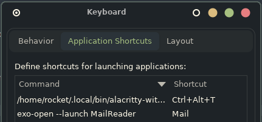
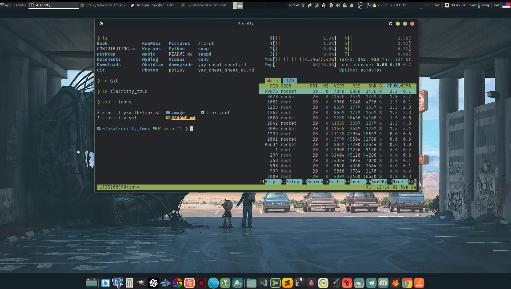

# Alacritty + tmux Setup on Arch Linux

This repository contains detailed instructions for setting up the Alacritty terminal with tmux on Arch Linux. The guide will walk you through the installation process, configuration setup, and how to automate the launching and closing of tmux sessions with a custom script.

## Table of Contents

- [Prerequisites](#prerequisites)
- [Step 1: Installing Alacritty](#step-1-installing-alacritty)
- [Step 2: Installing tmux](#step-2-installing-tmux)
- [Step 3: Creating the Custom Script](#step-3-creating-the-custom-script)
- [Step 4: Setting Up Keybindings](#step-4-setting-up-keybindings)
- [Step 5: Verifying the Setup](#step-5-verifying-the-setup)
- [Step 6: Final Touches](#step-6-final-touches)
- [Conclusion](#conclusion)

## Prerequisites

- Arch Linux system
- Basic understanding of terminal commands
- Access to sudo privileges

## Step 1: Installing Alacritty

Alacritty is a GPU-accelerated terminal emulator that you will use as your primary terminal.

1. Install Alacritty using pacman:
   ```zsh
   sudo pacman -S alacritty
```


2. Create the configuration file for Alacritty:


```
mkdir -p ~/.config/alacritty
touch ~/.config/alacritty/alacritty.yml
```
3. Add basic configurations to alacritty.yml:

Convert alacritty.yml to alacritty.toml if prompted:

`alacritty migrate`


## Step 2: Installing tmux
tmux is a terminal multiplexer that allows you to manage multiple terminal sessions from a single window.

Install tmux:
```zsh
sudo pacman -S tmux
```

Create a basic configuration file for tmux:

```zsh
touch ~/.tmux.conf
```
Add the following configuration to ~/.tmux.conf:


## Step 3: Creating the Custom Script

This script will automate the launching of Alacritty with tmux and ensure the tmux session is closed when the terminal is closed.

Create a directory for your custom scripts if it doesn't exist:


```zsh
mkdir -p ~/.local/bin
```

Create the script alacritty-with-tmux.sh:
```zsh
touch ~/.local/bin/alacritty-with-tmux.sh
chmod +x ~/.local/bin/alacritty-with-tmux.sh
```
Add the following content to the script:

Ensure the script is executable:

```zsh
chmod +x ~/.local/bin/alacritty-with-tmux.sh
```

## Step 4: Setting Up Keybindings

You can bind a custom key combination to launch this script instead of the default terminal.

For XFCE:
Open Settings -> Keyboard -> Application Shortcuts.
Find the existing shortcut for exo-open --launch TerminalEmulator and edit it.
Replace the command with:
```zsh
/home/rocket/.local/bin/alacritty-with-tmux.sh
```


Save and apply the changes.

## Step 5: Verifying the Setup
Press the keybinding (e.g., Ctrl+Alt+T) to launch the terminal with tmux.

Verify the tmux session is active:
`tmux ls`

Close the terminal and verify the session is deleted:
`tmux ls`

## Step 6: Final Touches
Customize your alacritty.toml and tmux.conf as needed to suit your workflow.

Make sure to keep your scripts organized in ~/.local/bin.
Conclusion
With this setup, you've now integrated Alacritty and tmux with an automated session management script, improving your productivity and streamlining your terminal experience on Arch Linux.

Feel free to modify and expand this configuration to fit your specific needs!




